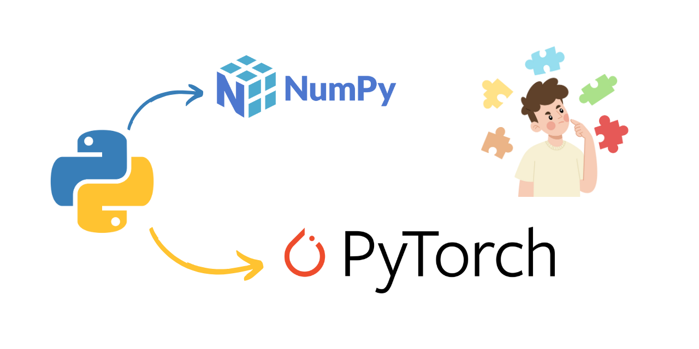
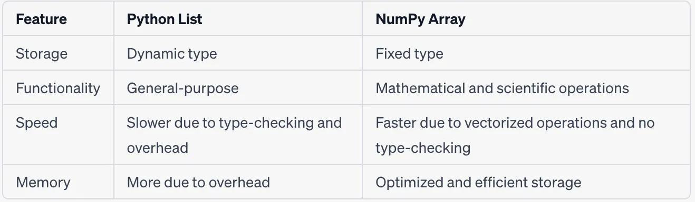
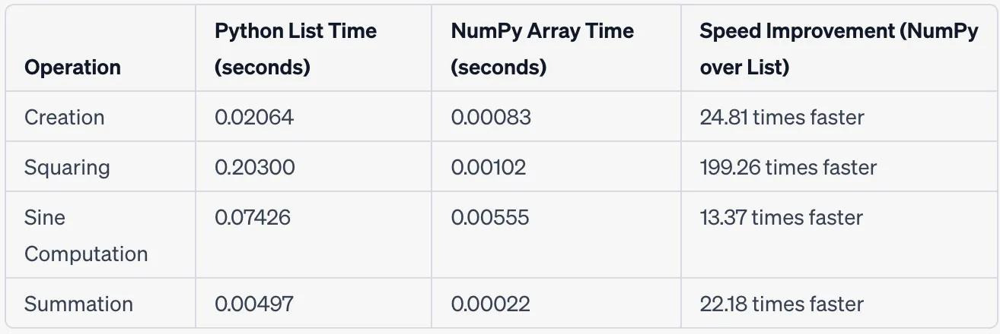

# numpyandpytorch

Why should we learn to use Numpy or PyTorch? 🤔

From this day forward, you'll have a clear and consice answer.



## Why ? 

[Andrej](https://karpathy.ai/) is always generous sharing the love towards Numpy & PyTorch, as seen [here](https://github.com/karpathy/nanoGPT?tab=readme-ov-file#install), [here](https://youtu.be/oBklltKXtDE?t=649) and [here](https://youtu.be/l8pRSuU81PU?t=251). 💚

But what is it that makes them so good? Can we simply demonstrate their abilities?

[This repository](https://github.com/jcjohnson/pytorch-examples) introduces the fundamental concepts of PyTorch through some examples. Special thanks to [Justin](https://github.com/jcjohnson) for a wonderful resource. I thought, we can extend the examples, starting from **Python Standard Library only**.

We'll use 3 examples only, to compare the Python Standart Library, Numpy and PyTorch. If you want to dive deeper and discover what PyTorch gives you, please see the original repository from Justin.

- <a href='#let-me-implement-this-myself'>Let me Implement this Myself</a>
- <a href='#raw-python'>Raw Python</a>
- <a href='#numpy'>numpy</a>
- <a href='#pytorch-tensors'>PyTorch</a>


## Let me Implement this Myself

Absolutely, that's the goal! 🤹

Depending on how you use python (with `venv` or `conda` environments), you can install all requirements with `requirements.txt`.

Here is a `venv` approach example:

```bash
# clone the repository
git clone https://github.com/kantarcise/numpyandpytorch.git

# make a virtual environment in the project root
python -m venv compareandlearn

# activate it and install packages
source compareandlearn/bin/activate

pip install -r requirements.txt
```

We will use a fully-connected ReLU network as our running example. 

The network will have a single hidden layer, and will be trained with gradient descent to fit random data by minimizing the Euclidean distance between the network output and the true output.

## Raw Python

Even before the implementation of Numpy, we can implement the network using only the standard library.

There is nothing stopping us from using Python `list`'s to make this work. 🤭

You can run the code within your virtual environment:

```bash
python src/naive_neural_network.py
```

The code will take some time (as expected), but it will work.

Here are the comparisons between using Python lists and Numpy arrays.



The performance difference is, well, see for yourself.



## numpy

Now, we will implement the same network using **Numpy**. 🤨

NumPy is a popular Python library that helps you work with multi-dimensional arrays—think of them as grids of numbers with various levels of depth. It offers a wide range of tools to perform operations on these arrays efficiently, making it a staple for scientific computing tasks.

While NumPy is excellent for general data manipulation and calculations, it doesn't come with built-in features for more advanced topics like deep learning, computation graphs, or automatically calculating gradients (which are essential for training complex neural networks).

But don't worry! Even without these advanced features, you can still use NumPy to make and train a simple two-layer neural network on random data, by manually implementing the forward and backward passes through the network using Numpy operations.

You can run the code as:

```bash
python src/numpy_neural_network.py
```

The speed is incredible compared to Python Standard Library 🍓.

## PyTorch: Tensors

Numpy is a great framework, but it cannot utilize GPUs to accelerate its numerical computations. For modern deep neural networks, GPUs often provide speedups of [50x or greater](https://github.com/jcjohnson/cnn-benchmarks), so unfortunately numpy won't be enough for modern deep learning.

PyTorch is a fully featured framework for building deep learning models, which is a type of machine learning. 🤔

Let's explore one of PyTorch's foundational concepts: the Tensor. At its core, a PyTorch Tensor is very similar to a NumPy array—it’s an n-dimensional array that allows you to store and manipulate data efficiently. Just like with NumPy, you can perform a wide range of mathematical operations on Tensors using PyTorch's extensive library of functions. Think of Tensors as the backbone of all computations in PyTorch, serving as a versatile tool for scientific computing.

While PyTorch Tensors and NumPy arrays share many similarities, there’s a significant advantage that PyTorch offers: the ability to leverage Graphics Processing Units (GPUs) for accelerated computations. This means that operations involving large-scale numerical data can be performed much faster when executed on a GPU. To utilize this power, you can specify the device argument when creating a Tensor, effectively placing it on the GPU.

In our final example, we'll use PyTorch Tensors to train a simple two-layer neural network on randomly generated data. Similar to our previous NumPy-based implementation, we'll manually implement the forward and backward passes through the network using Tensor operations.

You can run the code as:

```bash
python src/pytorch_neural_network.py
```

Depending on your hardware (GPU or CPU), the speed will be significantly improved, potentially by an order of magnitude.

### Summary

Now you have an answer to the question, *why should we learn and use Numpy & PyTorch*.

# Where will your curiousity guide you? 🌠

### Extras

To check out PyTorch Autograd, defining your own Autograd Operator, Tensorflow Static Graphs, the high level `nn`, `optim` modules and a Custom `nn` Module in PyTorch, see the original repo from Justin. 

Feel free to reach out if you have any questions or need further assistance. 

Keep discovering! 🚀
